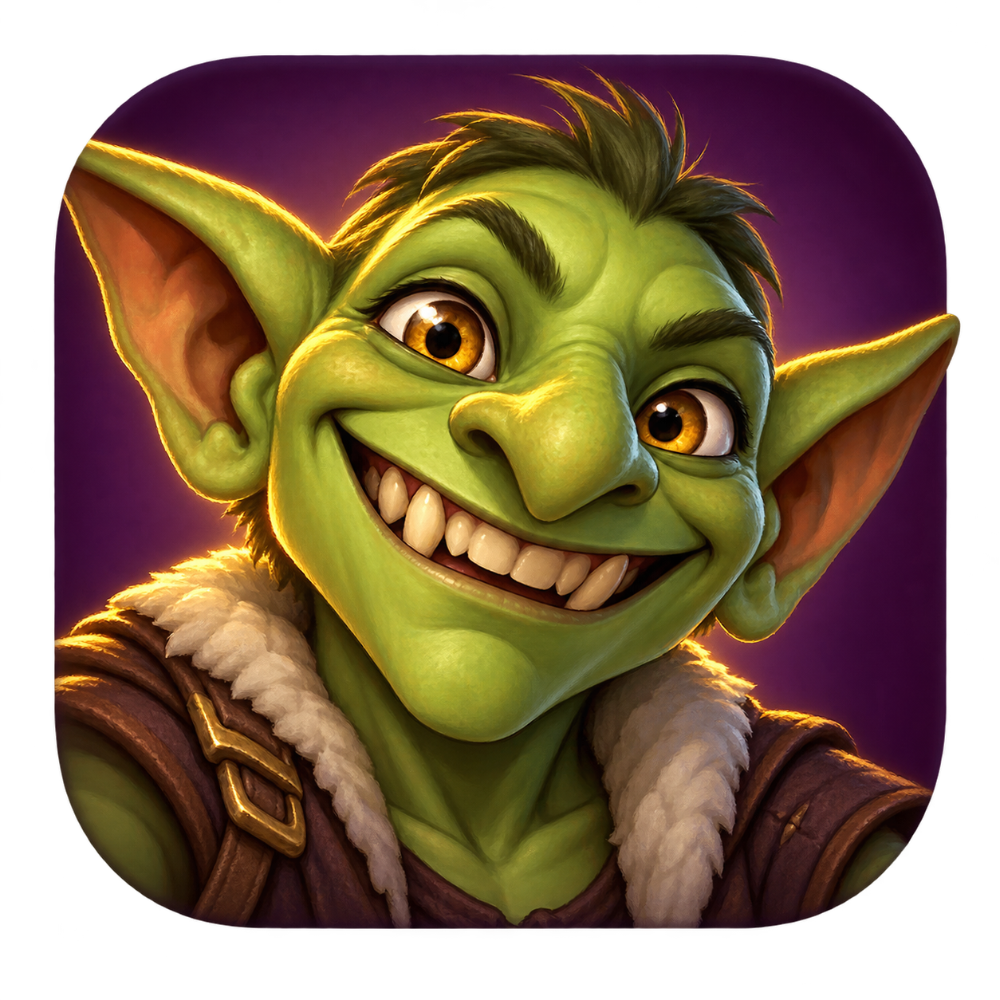

# Santa's MIT Companion

The Windows companion powers **Inventory** and **Chat Translator** on
[Santa's MIT](https://santasmit.com). Translation and saved Inventory stay on
your PC. This repository hosts downloads and installation instructions.

## Download for Windows

### [Get the Windows installer — 0.4.0 Preview 6](https://github.com/SantasHub/santas-mit-companion/releases/tag/v0.4.0-preview.6)

**Windows 10/11 · 64-bit x64 · 388 MB · Unsigned development preview**

Open the release above, then under **Assets** choose
**SantasMIT-LocalCompanion-0.4.0-preview6-release-setup.exe**.
Setup creates a **Santa's MIT Companion** desktop shortcut with the goblin selfie icon.
The **Source code (zip)** and **Source code (tar.gz)** entries are repository
archives; they do not install the Companion.

## Development preview

This is an unsigned development preview for **64-bit Windows 10 and Windows 11**.
A clean Windows installation test and publisher signing are still pending.
Windows may display an unknown-publisher warning; check the published SHA-256
before choosing whether to install. Do not disable Windows protection features.

[Third-party notices](THIRD-PARTY-NOTICES.md) · [License texts](licenses/)

## Getting started

1. Download the installer from the release above and run it.
2. Open **Santa's MIT Companion** from the new desktop shortcut (or Start menu)
   and check its setup status. If Npcap or the
   Microsoft Visual C++ runtime is missing, follow the official download link
   shown in setup, then select **Check setup again**. Npcap is not bundled.
3. Enable **Inventory** and/or **Chat Translator**, and enable website access in
   the companion. Observation is a separate opt-in for incoming Albion data.
4. Sign in to [Inventory](https://santasmit.com/app/inventory) or
   [Chat Translator](https://santasmit.com/app/chat-translator).
5. Select **Generate pairing code** in the companion and enter it on the website.
   Allow local network access if your browser asks. Pairing lasts for the current
   companion session, up to eight hours; you never enter an Albion password.

Spanish ↔ English and Portuguese ↔ English are included. **Add languages** in
the companion offers French, German and Russian. Translation works offline
after installation. Incoming messages in your selected language translate
automatically while Chat Translator is visible. You manually copy/send replies.

## Inventory

Start a bank read, then open Albion's **K** Bank Overview. Select each bank and
tab you want included. Wait for **Received**, review that tab and save it. Unread
tabs retain their previously saved contents. Albion may reuse cached contents;
the companion cannot request a resend or operate the game for you.

The website's **What can I make?** section uses saved materials across Crafting,
Refining, and Food & Potions. Review exact ingredient identities, select your
calculator profile and compare production options. Plans show pickup locations,
missing purchases, costs and production order, with shared materials, silver and
Focus limits. Matching and planning stay in the browser; economic results require
current market evidence. A saved bank is a snapshot, so check for moved or spent
items before relying on combined quantities.

## Chat Translator

Received player messages appear together in a temporary feed, including whispers.
Messages expire after one minute and the feed holds at most 128 messages. It may
differ from the chat tab selected inside Albion. You can also paste text manually.
Party and Alliance receipt have not yet been verified in live testing.

Select the incoming source and target languages to read automatic translations
beneath the originals. The included offline language detector leaves other
languages unchanged; short or mixed messages may require **Translate as…**.
Use **Pause auto-translation** when needed. Incoming and reply language controls
are independent. Navigation, pause and expiry stop or invalidate pending work;
automatic translation does not enable observation or send replies for you.

## Connection and data

The website talks directly to the paired companion on this PC. Saved Inventory is
encrypted for your Windows user; private Inventory and chat content are not
uploaded to the website. Leaving the workspace clears its private browser state.

Observation is passive and read-only. The companion does not inject into Albion,
read game process memory, send game packets, or automate gameplay. ExitLag
Legacy–NDIS worked in live tests; other routing modes are not verified. Compatibility
is not a guarantee against future game, anti-cheat or network changes.

Close the companion before updating. The installer preserves saved Inventory;
uninstalling also leaves the shared Npcap driver in place. Third-party notices are
included in the installation and release. Keep your original installer for recovery.
